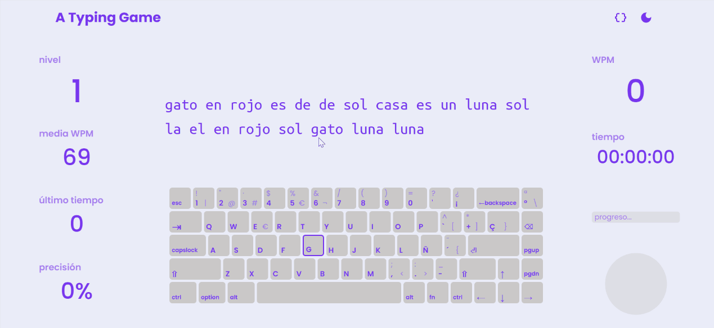

# A Typing Game - Juego de Mecanografía Interactivo 🖥️💬

Una aplicación web diseñada para mejorar la velocidad y precisión en la mecanografía. **A Typing Game** permite a los usuarios practicar con palabras, frases, o incluso fragmentos de código en varios lenguajes, proporcionando un seguimiento de métricas en tiempo real.

## 📋 Índice

- [Características](#características)
- [Vista Previa](#vista-previa)
- [Despliegue](#despliegue)
- [Uso](#uso)
- [Estructura del Proyecto](#estructura-del-proyecto)
- [Tecnologías Utilizadas](#tecnologías-utilizadas)
- [Contribuciones](#contribuciones)
- [Licencia](#licencia)

---

## ✨ Características

- **Práctica de Mecanografía**  
  Mejora tu mecanografía con palabras, frases, o fragmentos de código proporcionados por el usuario.

- **Panel de Métricas en Tiempo Real**  
  Visualización en vivo de:
  - Palabras por minuto y su promedio
  - Precisión global y por nivel
  - Gráfico dinámico de aciertos y errores
  - Tiempo invertido en cada nivel

- **Modo Oscuro/Claro**  
  Cambia entre temas para mayor comodidad visual.

- **Texto Autogenerado o Proporcionado por el Usuario**  
  Escoge entre practicar con texto generado automáticamente o subir tu propio texto o código.

---

## 🖼️ Vista Previa

Aquí tienes un ejemplo en acción:



---

## 🚀 Despliegue

### Acceso en línea
[**A Typing Game**](https://typing-game.netlify.app) *(enlace provisional, todavía no está desplegado)*

### Ejecución local

1. Clona este repositorio:
   ```bash
   git clone https://github.com/BeruzDev/a-typing-game
   ```
2. Instala las dependencias:
   ```bash
   npm install
   ```
3. Inicia el servidor de desarrollo:
   ```bash
   npm start
   ```
4. Accede a la aplicación en `http://localhost:3000`.

---

## 🕹️ Uso

1. Accede a la página y selecciona el tipo de práctica: **texto autogenerado** o **código proporcionado por el usuario**.
2. Comienza a mecanografiar el texto para activar las métricas en tiempo real.
3. Observa las métricas: velocidad, precisión, gráfico de aciertos y errores, y tiempo invertido en cada nivel.
4. Cambia entre **modo claro/oscuro** según tus preferencias.

---

## 🛠️ Tecnologías Utilizadas

- **Frontend**: React, Sass
- **Estilos**: SCSS, CSS Modules
- **Despliegue**: Netlify

---

## 🤝 Contribuciones

Las contribuciones son bienvenidas. 
Si deseas mejorar el proyecto, abre un issue o envía un pull request.

---

## 📄 Licencia

Este proyecto está bajo la Licencia MIT.
